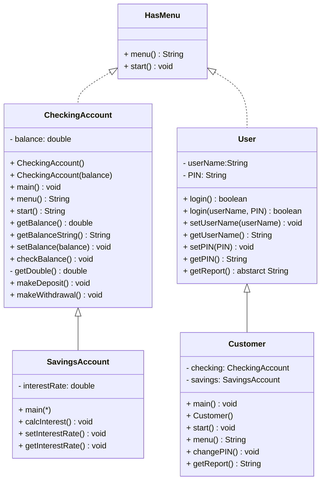

# CS121_project_10
(lab) Bank on it

```mermaid
classDiagram

class CheckingAccount{
    - balance: double
    + CheckingAccount()
    + CheckingAccount(balance)
    + main() void
    + menu() String
    + start() String
    + getBalance() double
    + getBalanceString() String
    + setBalance(balance) void
    + checkBalance() void
    - getDouble() double
    + makeDeposit() void
    + makeWithdrawal() void
}

class HasMenu{
    + menu() String
    + start() void
}

class SavingsAccount{
    - interestRate: double
    + main(*)
    + calcInterest() void
    + setInterestRate() void
    + getInterestRate() void
}

class User{
    - userName:String
    - PIN: String
    + login() boolean
    + login (userName, PIN) boolean
    + setUserName(userName) void
    + getUserName() String
    + setPIN(PIN) void
    + getPIN() String
    + getReport() abstarct String
}

class Customer{
    - checking: CheckingAccount
    - savings: SavingsAccount
    + main() void
    + Customer()
    + start() void
    + menu() String
    + changePIN() void
    + getReport() String
}

HasMenu <|.. CheckingAccount
HasMenu <|.. User
CheckingAccount <|-- SavingsAccount
User <|-- Customer
```
